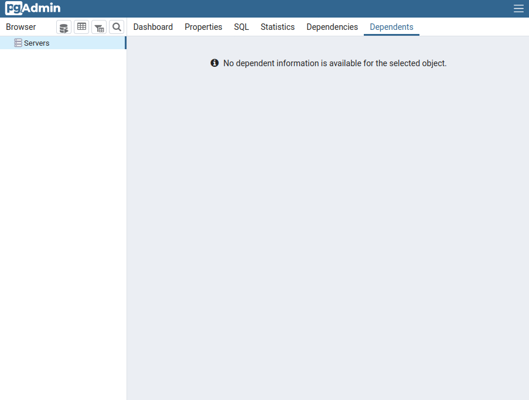

# HW-DBMS-2021-06
## Студент: **Воробьев Роман Николаевич**
## Проект: **ИС управления заказами**
### Описание: Данная информационная сиситема предназначена для управления заказами коллективом сотрудников, целью которых вляется:
- Поставка электронных компонентов
- Поставка печатных плат, изготавливаемых по заданию заказчика
- Поставка модулей с монтажом электронных компонентов на них

## Оглавление
- [1. Общее описаниие, ER-диаграмма](#1)
- [2. Дополнительные Ограничения и Индексы](#2)
- [3. Установка Postgres и подключение](#3)
- [4. Создание объектов БД](#4)
- [5. DML: вставка, обновление, удаление, выборка данных](#5)
- [6. Индексы и план запросов. Indexes and Explain](#6)
- [7. DML: агрегация и сортировка, CTE, аналитические функции](#7)
- [8. Репликация физическая и логическая](#8)

## <a id="1" /> 1. Общее описаниие, ER-диаграмма
### Структура организации состоит из отделов:
- Отдел по работе с клиентами
- Отдел закупок электронных компонентов
- Отдел Логистики и ВЭД
- Отдел склада и учета продукции

<code></code>

### Данная Система позволяет вести учет:
+ Поступающих заказов и их состава
+ Спецификаций модулей
+ Ценообразование в течении времени работы
+ Хранимых комопонентов и их расходование при выполнении заказов

Автоматизирует такие процессы как:
+ Составление ведомости закупки на основе состава модулей
+ Составление коммерческих предложений в разных вариациях по составу
+ Составление логистических и финансовых отчетов
+ Отслеживание всего заказа на всех его этапах от начала выставления коммерческого предложения до моммента отправки заказчику

## <a id="2" /> ### 2. Дополнительные Ограничения и Индексы
- table "People"
    - При создании таблицы добавляем ограничение на поле Age, которое ограничивает диапазон возраста.

    ```
    CONSTRAINT check_Age CHECK ( Age >0 AND Age < 100 )
    ```
   - Добавляем индекс для поиска Персоны, вероятней большую выборку дает фамилия, а Имя или Отчество дают равную выборку при том, что Имя чаще хранится иногда бывает Отчество не записано.

    ```
    CREATE INDEX Name ON "public".People USING btree
    (
        LastName,
        FirstName,
        Patronymic
    );
    ```

- table "Order"
    - Добавляем индекс по Имени Заказа, наиболее частый параметр для поиска.
    ```
    CREATE INDEX NameOrder ON "public"."Order" ( NameOrder );
    ```
- table "Goods"
    - Добавляем индекс по имени Товара со свойством уникальный
    ```
    CREATE UNIQUE INDEX NameGoods ON "public".Goods ( NameGoods ) INCLUDE ( NameGoods );
    ```
- table "CommercialOfferGoods"
    - При создании таблицы указываем ограничение на цену товара - должна быть больше 0.
    ```
    CONSTRAINT Check_Price CHECK ( PricePurchase > 0 )
    ```
## <a id="3" /> 3. Установка Postgres и подключение
    - Connect to Postgres from Docker
    - Connect to Postgres from PG Admin
## <a id="4" /> 4. Создание объектов БД
- [setup](./sql_scripts/pg-setup.sql)
- [create tables](./sql_scripts/create_tables.sql)
- [create users](./sql_scripts/create_users.sql)

## <a id="5" /> 5. DML: вставка, обновление, удаление, выборка данных

- Вставка данных
```
INSERT INTO public.organization(
	nameorganization, location, typeorganization)
	VALUES ('РНИИРС', 'г. Ростов-на-Дону', 'заказчик'),
  ('Алмаз-СП', 'г. Москва', 'исполнитель') RETURNING "Id";
```
- Вставка данных COPY
```
COPY prepare.goods (namegoods, pins, typeassembly_id, description)
FROM '/home/roman/Otus/HW-DBMS-2021-06/data/insert_goods_3.csv'
DELIMITER E'\\t' CSV QUOTE '\"' ESCAPE '''';"";
```
- Вставка данных с использованием SELECT
```
-- Создание заказа для расчета коммерческого предложения по компонентам
INSERT INTO management.commercialofferorder(ordersp_id, goodscustomer_id, quantityspecification, unit)
	SELECT orderspecification."Id", goods."Id" as goodscustomer_id, (orderspecification.quantity * modulespecification.quantity) as quantity, modulespecification.unit
	FROM management."Order"
			inner join management.orderspecification on "Order"."Id" = orderspecification.order_id
			inner join "prepare".modulespecification on orderspecification.module_id = modulespecification.module_id
			inner join "prepare".goods on modulespecification.goods_id = goods."Id";
```
- Запрос с использованием регулярного выражения
```
-- Запрос на поиск человека по части его имени
SELECT "Id", firstname, lastname, patronymic, age, tel_mobile, tel_work, "e-mail", departament, "Position", chief_id, organization_id, lastupdate
	FROM public.people
	WHERE firstname ~* '(р|о)о';
```
- Запрос с UPDATE FROM
```
-- Устанавливаем отвественного менеджера за расчет коммерческого предложения
UPDATE management.commercialofferorder
	SET managerpurchase_id=2, lastupdate=now()
	FROM management.commercialofferorder as co
		INNER JOIN management.orderspecification ON orderspecification."Id" = co.ordersp_id
	WHERE orderspecification.order_id = 1;
  ```
  - DELETE с использованием USING
  ```
  -- Удаляем модуль из спецификации заказа и расчета коммерческого предложения
DELETE FROM management.commercialofferorder
	USING management.orderspecification
		WHERE commercialofferorder.ordersp_id = orderspecification."Id" and orderspecification.module_id = 1;
```
## <a id="6" /> 6. Индексы и план запросов. Indexes and Explain

  - 1) Cоздание простого индекса
    ```
    CREATE UNIQUE INDEX IdGoods ON prepare.Goods ( id );
    CREATE UNIQUE INDEX NameGoods ON prepare.Goods ( NameGoods );
    ```
    Анализ запроса на 10000 записях
    ```
    explain (analyze)  select * from prepare.goods where namegoods = 'STTH6003CW';
    ```
    ```
    Index Scan using namegoods on goods  (cost=0.29..8.30 rows=1 width=75) (actual time=0.026..0.027 rows=1 loops=1)
      Index Cond: ((namegoods)::text = 'STTH6003CW'::text)
        Planning Time: 0.118 ms
        Execution Time: 0.047 ms
    ```
    При оценке работы индекса выснилось, что на малом количестве записей он не подключается, было вначале 241 запись в таблице

  - 2) Реализовать индекс полнотекстового поиска
    Для полнотекстового поиска создается индекс типа GIN
    ```
    CREATE INDEX search_index_namegoods ON prepare.goods USING GIN (namegoods_lexeme);
    ```
    Анализ запроса на 10000 записях
    ```
    explain (analyze) select * from prepare.goods where namegoods_lexeme @@ to_tsquery('0402');
    ```
    ```
    Bitmap Heap Scan on goods  (cost=12.67..168.89 rows=54 width=118) (actual time=0.040..0.055 rows=54 loops=1)
    Recheck Cond: (namegoods_lexeme @@ to_tsquery('0402'::text))
      Heap Blocks: exact=5
        ->  Bitmap Index Scan on search_index_namegoods  (cost=0.00..12.66 rows=54 width=0) (actual time=0.033..0.033 rows=54 loops=1)
        Index Cond: (namegoods_lexeme @@ to_tsquery('0402'::text))
        Planning Time: 14.298 ms
        Execution Time: 0.097 ms
    ```
    В этом поиске индекс не сильно уменьшил время запроса

  - 3) Реализовать индекс на часть таблицы или индекс на поле с функцией
    ```
    create index pins_great2 on prepare.goods(pins) where pins > 2;
    ```
    ```
    Bitmap Heap Scan on goods  (cost=4.33..26.00 rows=6 width=118)
      Recheck Cond: (pins > 60)
      ->  Bitmap Index Scan on pins_great2  (cost=0.00..4.33 rows=6 width=0)
        Index Cond: (pins > 60)
    ```

    При результирующей выборки на большое к-во строк ~9000  индекс не подключается.
    Когда условие сокращает результат то индекс подключается и сокращает время работы запроса

  - 4) Создать индекс на несколько полей
    ```
    CREATE INDEX namegoods_descrip ON prepare.goods (namegoods, description);
    ```
    ```
    Index Scan using namegoods_descrip on goods  (cost=0.29..8.30 rows=1 width=118)
      Index Cond: (((namegoods)::text = 'STW48NM60N'::text) AND ((description)::text = 'микросхема'::text))
    ```

    Индекс сильно сокращает время выборки

  - 5) Основное, с чем столкнулся это то, что индекс не подключается при малых записях в таблице и при большой выборке записей. Так же в поиске текстовых полях когда сравнение по оператору like индекс тоже не подключается

## <a id="7" /> 7. DML: агрегация и сортировка, CTE, аналитические функции

  - Задание: Посчитать кол-во очков по всем игрокам за текущий год и за предыдущий.

- 1) Создайте таблицу и наполните ее данными
  ```
  CREATE TABLE public.statistic( player_name VARCHAR(100) NOT NULL, player_id INT NOT NULL, year_game SMALLINT NOT NULL CHECK (year_game > 0), points DECIMAL(12,2) CHECK (points >= 0), PRIMARY KEY (player_name,year_game) );
  ```
- 2) Заполнить данными
  ```
  INSERT INTO statistic(player_name, player_id, year_game, points) VALUES ('Mike',1,2018,18), ('Jack',2,2018,14), ('Jackie',3,2018,30), ('Jet',4,2018,30), ('Luke',1,2019,16), ('Mike',2,2019,14), ('Jack',3,2019,15), ('Jackie',4,2019,28), ('Jet',5,2019,25), ('Luke',1,2020,19), ('Mike',2,2020,17), ('Jack',3,2020,18), ('Jackie',4,2020,29), ('Jet',5,2020,27);
  ```
- 3) Написать запрос суммы очков с группировкой и сортировкой по годам.
  ```
  SELECT year_game, sum(points) as sum_points FROM public.statistic GROUP BY year_game ORDER BY year_game asc;
  ```
- 4) Написать cte показывающее тоже самое.
  ```
  WITH points_year AS(
	  SELECT year_game, sum(points) as sum_points FROM public.statistic GROUP BY year_game ORDER BY year_game ASC
  )
  SELECT * FROM points_year;
  ```

- 5) Используя функцию LAG вывести кол-во очков по всем игрокам за текущий код и за предыдущий
  ```
  select sum(points), year_game, LAG(sum(points)) OVER(order by year_game asc) as last_points
  from public.statistic
  group by year_game;
  ```
- 6) Вариант вывода количества очков каждого игрока за текущий и предыдущий год

  ```
  select player_name, points, year_game, LAG(points) OVER(partition by player_name order by year_game asc) as last_points
  from public.statistic;
  ```

## <a id="8" /> 8. Репликация физическая и логическая
  - Задание:
    - Физическая репликация:
      Весь стенд собирается в Docker образах.
      Необходимо:
      - Настроить физическую репликации между двумя кластерами базы данных
      - Репликация должна работать использую "слот репликации"
      - Реплика должна отставать от мастера на 5 минут
    - Логическая репликация:В стенд добавить еще один кластер Postgresql.
      Необходимо:
      - Создать на первом кластере базу данных, таблицу и наполнить ее данными
      - На нем же создать публикацию этой таблицы
      - На новом кластере подписаться на эту публикацию
      - Убедиться что она среплицировалась. Добавить записи в эту таблицу на основном сервере и убедиться, что они видны на логической реплике
  - Решение
    - Replication Postgres from Docker
    - Logical Postgres from Docker
