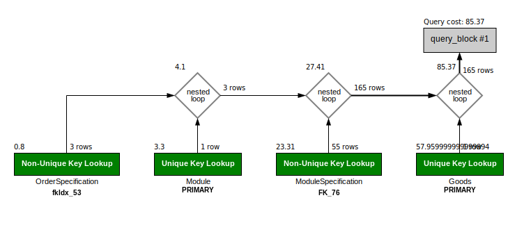

# HW-DBMS-2021-06
## Студент: **Воробьев Роман Николаевич**
## Проект: **ИС управления заказами**
### Описание: Данная информационная сиситема предназначена для управления заказами коллективом сотрудников, целью которых вляется:
- Поставка электронных компонентов
- Поставка печатных плат, изготавливаемых по заданию заказчика
- Поставка модулей с монтажом электронных компонентов на них

## Оглавление
- [1. Общее описаниие, ER-диаграмма](#1)
- [2. Дополнительные Ограничения и Индексы](#2)
- [3. Установка Postgres и подключение](#3)
- [4. Создание объектов БД](#4)
- [5. DML: вставка, обновление, удаление, выборка данных](#5)
- [6. Индексы и план запросов. Indexes and Explain](#6)
- [7. DML: агрегация и сортировка, CTE, аналитические функции](#7)
- [8. Репликация физическая и логическая](#8)
- [9. Создание базы данных MySql в Docker](#9)
- [10. Типы данных в MySQL](#10)
- [11. SQL выборка](#11)
- [12. Транзакции](#12)
- [13. Отчетная выборка](#13)
- [14. Индексы MySQL](#14)
- [15. Анализ и профилирование запроса](#15)
- [16. Хранимые процедуры и триггеры](#16)
- [17. Восстановить таблицу из бэкапа](#17)
- [18. Спрогнозировать рост данных и спроектировать модель хранения и архивации](#18)
- [19. Построить модель данных](#19)
---
## <a id="1" /> 1. Общее описаниие, ER-диаграмма
### Структура организации состоит из отделов:
- Отдел по работе с клиентами
- Отдел закупок электронных компонентов
- Отдел Логистики и ВЭД
- Отдел склада и учета продукции

<code></code>

### Данная Система позволяет вести учет:
+ Поступающих заказов и их состава
+ Спецификаций модулей
+ Ценообразование в течении времени работы
+ Хранимых комопонентов и их расходование при выполнении заказов

Автоматизирует такие процессы как:
+ Составление ведомости закупки на основе состава модулей
+ Составление коммерческих предложений в разных вариациях по составу
+ Составление логистических и финансовых отчетов
+ Отслеживание всего заказа на всех его этапах от начала выставления коммерческого предложения до моммента отправки заказчику
---
## <a id="2" /> 2. Дополнительные Ограничения и Индексы
- table "People"
    - При создании таблицы добавляем ограничение на поле Age, которое ограничивает диапазон возраста.

    ```
    CONSTRAINT check_Age CHECK ( Age >0 AND Age < 100 )
    ```
   - Добавляем индекс для поиска Персоны, вероятней большую выборку дает фамилия, а Имя или Отчество дают равную выборку при том, что Имя чаще хранится иногда бывает Отчество не записано.

    ```
    CREATE INDEX Name ON "public".People USING btree
    (
        LastName,
        FirstName,
        Patronymic
    );
    ```

- table "Order"
    - Добавляем индекс по Имени Заказа, наиболее частый параметр для поиска.
    ```
    CREATE INDEX NameOrder ON "public"."Order" ( NameOrder );
    ```
- table "Goods"
    - Добавляем индекс по имени Товара со свойством уникальный
    ```
    CREATE UNIQUE INDEX NameGoods ON "public".Goods ( NameGoods ) INCLUDE ( NameGoods );
    ```
- table "CommercialOfferGoods"
    - При создании таблицы указываем ограничение на цену товара - должна быть больше 0.
    ```
    CONSTRAINT Check_Price CHECK ( PricePurchase > 0 )
    ```
---
## <a id="3" /> 3. Установка Postgres и подключение
  - Connect to Postgres from Docker
  - Connect to Postgres from PG Admin
---
## <a id="4" /> 4. Создание объектов БД
  - [setup](./sql_scripts/setup_DB/pg-setup.sql)
  - [create tables](./sql_scripts/setup_DB/create_tables.sql)
  - [create users](./sql_scripts/setup_DB/create_users.sql)
---
## <a id="5" /> 5. DML: вставка, обновление, удаление, выборка данных
- Вставка данных
```
INSERT INTO public.organization(
	nameorganization, location, typeorganization)
	VALUES ('РНИИРС', 'г. Ростов-на-Дону', 'заказчик'),
  ('Алмаз-СП', 'г. Москва', 'исполнитель') RETURNING "Id";
```
- Вставка данных COPY
```
COPY prepare.goods (namegoods, pins, typeassembly_id, description)
FROM '/home/roman/Otus/HW-DBMS-2021-06/data/insert_goods_3.csv'
DELIMITER E'\\t' CSV QUOTE '\"' ESCAPE '''';"";
```
- Вставка данных с использованием SELECT
```
-- Создание заказа для расчета коммерческого предложения по компонентам
INSERT INTO management.commercialofferorder(ordersp_id, goodscustomer_id, quantityspecification, unit)
	SELECT orderspecification."Id", goods."Id" as goodscustomer_id, (orderspecification.quantity * modulespecification.quantity) as quantity, modulespecification.unit
	FROM management."Order"
			inner join management.orderspecification on "Order"."Id" = orderspecification.order_id
			inner join "prepare".modulespecification on orderspecification.module_id = modulespecification.module_id
			inner join "prepare".goods on modulespecification.goods_id = goods."Id";
```
- Запрос с использованием регулярного выражения
```
-- Запрос на поиск человека по части его имени
SELECT "Id", firstname, lastname, patronymic, age, tel_mobile, tel_work, "e-mail", departament, "Position", chief_id, organization_id, lastupdate
	FROM public.people
	WHERE firstname ~* '(р|о)о';
```
- Запрос с UPDATE FROM
```
-- Устанавливаем отвественного менеджера за расчет коммерческого предложения
UPDATE management.commercialofferorder
	SET managerpurchase_id=2, lastupdate=now()
	FROM management.commercialofferorder as co
		INNER JOIN management.orderspecification ON orderspecification."Id" = co.ordersp_id
	WHERE orderspecification.order_id = 1;
  ```
  - DELETE с использованием USING
  ```
  -- Удаляем модуль из спецификации заказа и расчета коммерческого предложения
DELETE FROM management.commercialofferorder
	USING management.orderspecification
		WHERE commercialofferorder.ordersp_id = orderspecification."Id" and orderspecification.module_id = 1;
```
---
## <a id="6" /> 6. Индексы и план запросов. Indexes and Explain

  - 1. Cоздание простого индекса
    ```
    CREATE UNIQUE INDEX IdGoods ON prepare.Goods ( id );
    CREATE UNIQUE INDEX NameGoods ON prepare.Goods ( NameGoods );
    ```
    Анализ запроса на 10000 записях
    ```
    explain (analyze)  select * from prepare.goods where namegoods = 'STTH6003CW';
    ```
    ```
    Index Scan using namegoods on goods  (cost=0.29..8.30 rows=1 width=75) (actual time=0.026..0.027 rows=1 loops=1)
      Index Cond: ((namegoods)::text = 'STTH6003CW'::text)
        Planning Time: 0.118 ms
        Execution Time: 0.047 ms
    ```
    При оценке работы индекса выснилось, что на малом количестве записей он не подключается, было вначале 241 запись в таблице

  - 2. Реализовать индекс полнотекстового поиска
    Для полнотекстового поиска создается индекс типа GIN
    ```
    CREATE INDEX search_index_namegoods ON prepare.goods USING GIN (namegoods_lexeme);
    ```
    Анализ запроса на 10000 записях
    ```
    explain (analyze) select * from prepare.goods where namegoods_lexeme @@ to_tsquery('0402');
    ```
    ```
    Bitmap Heap Scan on goods  (cost=12.67..168.89 rows=54 width=118) (actual time=0.040..0.055 rows=54 loops=1)
    Recheck Cond: (namegoods_lexeme @@ to_tsquery('0402'::text))
      Heap Blocks: exact=5
        ->  Bitmap Index Scan on search_index_namegoods  (cost=0.00..12.66 rows=54 width=0) (actual time=0.033..0.033 rows=54 loops=1)
        Index Cond: (namegoods_lexeme @@ to_tsquery('0402'::text))
        Planning Time: 14.298 ms
        Execution Time: 0.097 ms
    ```
    В этом поиске индекс не сильно уменьшил время запроса

  - 3. Реализовать индекс на часть таблицы или индекс на поле с функцией
    ```
    create index pins_great2 on prepare.goods(pins) where pins > 2;
    ```
    ```
    Bitmap Heap Scan on goods  (cost=4.33..26.00 rows=6 width=118)
      Recheck Cond: (pins > 60)
      ->  Bitmap Index Scan on pins_great2  (cost=0.00..4.33 rows=6 width=0)
        Index Cond: (pins > 60)
    ```

    При результирующей выборки на большое к-во строк ~9000  индекс не подключается.
    Когда условие сокращает результат то индекс подключается и сокращает время работы запроса

  - 4. Создать индекс на несколько полей
    ```
    CREATE INDEX namegoods_descrip ON prepare.goods (namegoods, description);
    ```
    ```
    Index Scan using namegoods_descrip on goods  (cost=0.29..8.30 rows=1 width=118)
      Index Cond: (((namegoods)::text = 'STW48NM60N'::text) AND ((description)::text = 'микросхема'::text))
    ```

    Индекс сильно сокращает время выборки

  - 5. Основное, с чем столкнулся это то, что индекс не подключается при малых записях в таблице и при большой выборке записей. Так же в поиске текстовых полях когда сравнение по оператору like индекс тоже не подключается
---
## <a id="7" /> 7. DML: агрегация и сортировка, CTE, аналитические функции

  - Задание: Посчитать кол-во очков по всем игрокам за текущий год и за предыдущий.

- 1. Создайте таблицу и наполните ее данными
  ```
  CREATE TABLE public.statistic( player_name VARCHAR(100) NOT NULL, player_id INT NOT NULL, year_game SMALLINT NOT NULL CHECK (year_game > 0), points DECIMAL(12,2) CHECK (points >= 0), PRIMARY KEY (player_name,year_game) );
  ```
- 2. Заполнить данными
  ```
  INSERT INTO statistic(player_name, player_id, year_game, points) VALUES ('Mike',1,2018,18), ('Jack',2,2018,14), ('Jackie',3,2018,30), ('Jet',4,2018,30), ('Luke',1,2019,16), ('Mike',2,2019,14), ('Jack',3,2019,15), ('Jackie',4,2019,28), ('Jet',5,2019,25), ('Luke',1,2020,19), ('Mike',2,2020,17), ('Jack',3,2020,18), ('Jackie',4,2020,29), ('Jet',5,2020,27);
  ```
- 3. Написать запрос суммы очков с группировкой и сортировкой по годам.
  ```
  SELECT year_game, sum(points) as sum_points FROM public.statistic GROUP BY year_game ORDER BY year_game asc;
  ```
- 4. Написать cte показывающее тоже самое.
  ```
  WITH points_year AS(
	  SELECT year_game, sum(points) as sum_points FROM public.statistic GROUP BY year_game ORDER BY year_game ASC
  )
  SELECT * FROM points_year;
  ```

- 5. Используя функцию LAG вывести кол-во очков по всем игрокам за текущий код и за предыдущий
  ```
  select sum(points), year_game, LAG(sum(points)) OVER(order by year_game asc) as last_points
  from public.statistic
  group by year_game;
  ```
- 6. Вариант вывода количества очков каждого игрока за текущий и предыдущий год

  ```
  select player_name, points, year_game, LAG(points) OVER(partition by player_name order by year_game asc) as last_points
  from public.statistic;
  ```
---
## <a id="8" /> 8. Репликация физическая и логическая
  - Задание:
    - Физическая репликация:
      Весь стенд собирается в Docker образах.
      Необходимо:
      - Настроить физическую репликации между двумя кластерами базы данных
      - Репликация должна работать использую "слот репликации"
      - Реплика должна отставать от мастера на 5 минут
    - Логическая репликация:В стенд добавить еще один кластер Postgresql.
      Необходимо:
      - Создать на первом кластере базу данных, таблицу и наполнить ее данными
      - На нем же создать публикацию этой таблицы
      - На новом кластере подписаться на эту публикацию
      - Убедиться что она среплицировалась. Добавить записи в эту таблицу на основном сервере и убедиться, что они видны на логической реплике
  - Решение
    - Replication Postgres from Docker
    - Logical Postgres from Docker
---
## <a id="9" /> 9. Создание базы данных MySql в Docker
  - Задание: Упаковка скриптов создания БД в контейнер
  1. забрать стартовый репозиторий https://github.com/aeuge/otus-mysql-docker
  2. прописать sql скрипт для создания своей БД в init.sql
  3. проверить запуск и работу контейнера следую описанию в репозитории
  4. прописать кастомный конфиг - настроить innodb_buffer_pool и другие параметры по желанию
    *) протестить сисбенчем - результат теста приложить в README
  - Решение:
    - [Скрипт init](./Mysql-Docker/init.sql)
    - [Файл конфига](./Mysql-Docker/custom.conf/my.cnf)
---
## <a id="10" /> 10. Типы данных в MySQL
  - Задание: Вдумчиво подбираем нужные типы данных. Определяемся с типом ID. Изучаем тип JSON
  1. Проанализировать типы данных в своем проекте, изменить при необходимости. В README указать что на что поменялось и почему.
  2. Добавить тип JSON в структуру. Проанализировать какие данные могли бы там хранится. привести примеры SQL для добавления записей и выборки.
  - Решение:
  1.
     - Типы ID разделены на два: Int используется для таблиц справочников, которые содержат исходные данные и основные сущности. Тип bigint используется в операционных таблицах.
     - Типы для цены товара  определны как decimal(20, 6), позволяющие хранить и вычислять с высокой точностью
     - Для унификации количественные поля так же определены decimal(20, 6)
     - Типы varchar для хранения названий и характеристик товаров и для описания Людей в таблице People
     - Тип timestamp определен для каждой таблицы для хранения даты и времени изменения записи, возможно еще нужно добавить дополнительное поле для хранения TimeZone
     - Тип date определен для хранения даты связанной с ключевыми временными точками движения товара
     - Тип json можно определить для хранения данных пользователей и клиентов, такких как телефон, почта и другие дополнительные данные.
     Так же json можно использовать для хранения параметров электронных компонентов, которые очень разнообразны и могут сильно
     расширять поля сущности без использования json
  2. JSON:
  - [Скрипт select](./Mysql-Docker/scripts/json_select.sql)
  - [Скрипт inset](./Mysql-Docker/scripts/json_insert.sql)
---
## <a id="11" /> 11. SQL выборка
  - Задание: Научиться джойнить таблицы и использовать условия в SQL выборке
  1. Напишите запрос по своей базе с inner join
  2. Напишите запрос по своей базе с left join
  3. Напишите 5 запросов с WHERE с использованием разных операторов, опишите для чего вам в проекте нужна такая выборка данных
  - Решение:
  - [Выбор спецификации конкретного модуля](./Mysql-Docker/scripts/select_inner.sql)
  - [Выбор сводной коммерческого предложения все хкомпонентов в одном заказе](./Mysql-Docker/scripts/select_left_join.sql)
  - [Запросы с WHERE](./Mysql-Docker/scripts/select_where.sql)
---
## <a id="12" /> 12. Транзакции
  - Задание: Заполнение своего проекта данными
  1. Описать пример транзакции из своего проекта с изменением данных в нескольких таблицах. Реализовать в виде хранимой процедуры.
  2. Загрузить данные из приложенных в материалах csv. Реализовать следующими путями:
      - LOAD DATA
      - mysqlimport
      - *) реализовать загрузку через fifo

  - Решение:
  1. [Хранимая процедура для изменения данных в спецификации модуля и последующее изменение заказа компонентов](./Mysql-Docker/scripts/procedureUpdateOrder.sql)
  2. [Скрипт создание таблицы и загрузки в нее данных](./Mysql-Docker/load_csv/create_and_load_table.sql)
---
## <a id="13" /> 13. Отчетная выборка
  - Задание: Научиться создавать отчетную выборку, предоставить результат
группировки с ипользованием CASE, HAVING, ROLLUP, GROUPING():
  1. К списку продуктов добавить максимальную и минимальную цену и кол-во предложений;
  2. Сделать выборку, показывающую самый дорогой и самый дешевый товар в каждой категории;
  3. Сделать rollup с количеством товаров по категориям;
  - Решение:
  1. Запрос с группировкой по валюте с минимальной, максимальной ценой и количеству товаров
  ```
SELECT count(g.NameGoods) as count, sum(co.PricePurchase*co.QuantityPurchase) as sum, co.Currency, max(co.PricePurchase) as max_price, min(co.PricePurchase) min_price
	FROM CommercialOfferGoods as co
	  INNER JOIN Goods as g on g.id = co.GoodsManufacture_id
    WHERE g.id <> 1
    GROUP BY co.Currency
    ORDER BY count;
  ```
  2. Запрос с группировкой по типу товара минимальной, максимальной ценой и количеством в каждой группе
  ```
  SELECT g.Description as type, min(co.PricePurchase) as min_price, max(co.PricePurchase) as max_price, count(g.NameGoods) as count
	FROM CommercialOfferGoods as co
	  INNER JOIN Goods as g on g.id = co.GoodsManufacture_id
    WHERE g.id <> 1
    GROUP BY g.Description
    ORDER BY count;
  ```
  3. Запрос с rollup группировкой по типам товара
  ```
  SELECT
	IF(GROUPING(g.Description), 'All types', g.Description) as type,
    count(g.NameGoods) as count
	FROM CommercialOfferGoods as co
	  INNER JOIN Goods as g on g.id = co.GoodsManufacture_id
    WHERE g.id <> 1
    GROUP BY g.Description WITH ROLLUP
    ORDER BY count;
  ```
---
## <a id="14" /> 14. Индексы MySQL
  - Задание: Пересматриваем индексы на своем проекте. По необходимости меняем.
  1. Сделать полнотекстовый индекс, который ищет по свойствам, названию товара и описанию.
  2. Анализируем свой проект - добавляем или обновляем индексы.
  3. В README пропишите какие индексы были изменены или добавлены, explain и результаты выборки без индекса и с индексом.;
  - Решение:
  1. Полнотекстовый поиск
  - создание полнотекстового индекса
  ```
  FULLTEXT FullIdxNameDescription (`NameGoods`,`Description`)
  ```
  - запрос
```
SELECT id, NameGoods, Description FROM Goods WHERE MATCH(NameGoods,Description) AGAINST ('0402');
```
  2. Добавлены индексы на ForeignKey и индексы на поля содержащие имена в текстовом виде, для таблицы People сделан составной индекс
  ```
  INDEX fullName (FirstName, LastName, Patronymic)
  ```
  3. Анализ индексов
  ```
  SELECT id, NameGoods, Description
	FROM Goods
    WHERE NameGoods = 'GRM155R61E105K (0402 X5R 1 мкФ ±10% 25 В)';
  ```
  - без индекса
    - id,  select_type, table,   partitions, type,    possible_keys, key,            key_len, ref,    rows,  filtered, Extra
'1', 'SIMPLE',    'Goods', NULL,       'ALL',   NULL,          NULL,           NULL,    NULL,   '242', '0.41',   'Using where'
  - с индексом
    - '1', 'SIMPLE',    'Goods', NULL,       'const', 'IdxNameGoods','IdxNameGoods', '1002', 'const', '1',   '100.00', NULL
---
## <a id="15" /> 15. Анализ и профилирование запросов
- Задание: Проанализировать план выполнения запроса, заценить на чем теряется время.
  1. Возьмите сложную выборку из предыдущих ДЗ с несколькими join и подзапросами.
  2. Постройте EXPLAIN в 3 формата.
  3. Оцените план прохождения запроса, найдите самые тяжелые места.
  4. Попробуйте оптимизировать запрос (можно использовать индексы, хинты, сбор статистики, гистограммы).
  5. Все действия и результаты опишите в README.md.
- Решение:
  1. Выбираем запрос Select из запроса на обновления таблицы Коммерческого Предложения Заказа
  ```
  	SELECT OrderSpecification.id as OrderSp_id, Goods.id as GoodsCustomer_id, ModuleSpecification.Quantity*OrderSpecification.Quantity as QuantitySpecification, ModuleSpecification.unit as unit
		FROM OrderSpecification
			INNER JOIN Module ON Module.id = OrderSpecification.Module_id
			INNER JOIN ModuleSpecification ON ModuleSpecification.Module_Id = Module.id
			INNER JOIN Goods ON Goods.id = ModuleSpecification.Goods_Id
		WHERE OrderSpecification.Order_id = 2;
  ```
  2.
  - Табличное представление Explain содержит 4 простых выборки из таблиц, использующих либо Primary Key либо Forein Key для индексации запросов уникальных и неуникальных индексов соответственно. Длина ключа составляет 4 или 8 байт. По значению filtered будет просмотрено 100% записей и по значению row будет выбрано 55 строк. Для двух таблиц Goods и Module используются покрывающие индексы.
   - Визуальный план отображает последовательность выборки:
    OrderSpecification 3 rows -> Module (1 row) 3 rows -> ModuleSpecification (55 rows) 165 rows -> Goods (1 rows) итог 165 rows
    Похоже для получения уникальных данных соединение к таблицы Goods является избыточным
  <code></code>
  - [Результат в формате json](./Mysql-Docker/explain_data/explain_json.txt)
  - Представление в виде дерева:
    ```
    -> Nested loop inner join  (cost=83.12 rows=166)
      -> Nested loop inner join  (cost=25.16 rows=166)
          -> Nested loop inner join  (cost=1.85 rows=3)
              -> Index lookup on OrderSpecification using fkIdx_53 (Order_id=2)  (cost=0.80 rows=3)
              -> Single-row covering index lookup on Module using PRIMARY (id=OrderSpecification.Module_id)  (cost=0.28 rows=1)
          -> Index lookup on ModuleSpecification using FK_76 (Module_Id=OrderSpecification.Module_id)  (cost=4.09 rows=55)
      -> Single-row covering index lookup on Goods using PRIMARY (id=ModuleSpecification.Goods_Id)  (cost=0.25 rows=1)
    ```
---
## <a id="16" /> 16. Хранимые процедуры и триггеры
- Задание: Добавляем в базу хранимые процедуры и триггеры. Научиться создавать пользователей, процедуры и триггеры
  1. Создать пользователей client, manager.
  2. Создать процедуру выборки товаров с использованием различных фильтров: категория, цена, производитель, различные дополнительные параметры Также в качестве параметров передавать по какому полю сортировать выборку, и параметры постраничной выдачи.
  3. Дать права да запуск процедуры пользователю client.
  4. Создать процедуру get_orders - которая позволяет просматривать отчет по продажам за определенный период (час, день, неделя) с различными уровнями группировки (по товару, по категории, по производителю)Создать процедуру get_orders - которая позволяет просматривать отчет по продажам за определенный период (час, день, неделя) с различными уровнями группировки (по товару, по категории, по производителю).
  5. Права дать пользователю manager.
- Решение:
  1. [Процедура для фильтрации](./Mysql-Docker/scripts/proc_filter.sql)
  2. Создание пользователя с правами на запуск процедуры
  ```
  CREATE USER 'client'@'localhost' IDENTIFIED BY 'test12345';
  CREATE USER 'manager'@'localhost' IDENTIFIED BY 'test12345';
  GRANT EXECUTE ON PROCEDURE orderManSys.queryFilter TO 'test_user'@'localhost';
  GRANT EXECUTE ON PROCEDURE orderManSys.get_orders TO 'manager'@'localhost';
  ```
  3. [Процедура get_orders](./Mysql-Docker/scripts/proc_get_orders.sql)
---
## <a id="17" /> 17. Восстановить таблицу из бэкапа
- Задание: Задача восстановить конкретную таблицу из сжатого и шифрованного бэкапа. Осваиваем инструмент для резервного копирования и восстановления - xtrabackup
- Решение:
  1. Расшифровываем файл:
  ```
  openssl des3 -salt -k "password" -d \
    -in stream/backup_des.xbstream.gz.des3 \
    -out stream/backup_des.xbstream.gz
  ```
  2. Распаковка файла:
  ```
  gzip -d stream/backup_des.xbstream.gz
  ```
  3. Извлечение backup:
  ```
  xbstream -x < backup_des.xbstream
  ```
  4. Подготовка backup
  ```
  sudo xtrabackup --prepare --export --target-dir=/tmp/backups/xtrabackup/world_backup
  ```
  5. Подготовка БД world
  ```
  mysql
  create database world;
  world < world_db.sql;
  alter table city discard tablespace;
  ```
  6. Копирование и назначение прав
  ```
  sudo cp world_backup/world/city.ibd /var/lib/mysql/world
  sudo chown -R mysql.mysql /var/lib/mysql/world/city.ibd
  ```
  7. Восстановление tablespace
  ```
  sudo mysql world
  alter table city import tablespace;
  select count(*) from city where countrycode = 'RUS';
  ```
  8. Результат - 189
---
## <a id="18" /> 18. Спрогнозировать рост данных и спроектировать модель хранения и архивации
- Задание: Научиться прогнозировать рост данных и возможные проблемы
  1. Формируем документ в котором описываем
    - прогноз по возможному росту базы
      * рост данных
      * рост количества пользователей
      * всплески одновременных соединений
  2. Описываем возможные угрозы и методы защиты от них
    * предлагаем стратегии бэкапа
      - репликации
      - кластеризации
- Решение:
  1. Описание пользователей: Данная информационная система управления заказами - ИСУЗ предназначена для пользователей из нескольких отделов.
  - отдел по работе с клиентами;
  - отдел закупки комплектующих
  - отдел логистики
  - отдел складского учета
  - отдел учета и ОТК монтажной продукции
  2. Колличество пользователей в каждом отделе в среднем составляет 5 человек.
  3. Создаваемые данные:
    - отдел по работе с клиентами в основном создает первичный заказ и данные по спецификации загружает за раз 100 позиций при создании Блоков монтажа и при создании заказа создает новых записей в среднем 2000 позиций. Можно ожидать по опыту в месяц создается 10000 новых записей в таблице заказ, 1000 новых записей в таблицу  номенклатуры, 4000 записей в таблицу спецификаций.
    Стоит ожидать что остальные таблицы связанные с закупкой компонентов тоже в месяц будут генерить новых 10000 записей.
    - отдел логистики обновляет данные по поям связанных со статусом группы товаров - дата доставки, счет, груз, номер заказа. Обновляют в среднем 300 записей.
    - остальные отделы работают по позиционно и делают новые записи или обновляют по 1-5 записей одномоментно.
  4. Рост пользователей:
    - За последнее время в компании не наблядался значительный рост сотрудников, за период в 3 года увеличился состав каждого отдела на одного сотрудника. При чем при внедрении ИСУЗ ожидается упрощение работы и новых сотрудников отделов склада и управления заказами не планируется нанимать.
  5. Соединения с БД ожидаются в полном составе всех отделов принимающие участие в операционной деятельности, это 25 сотрудников, плюс возможны перманентные подключения до 5 сотрудников руководства для полученя отчетности и статусов заказа.
  6.
    - сервер БД планируется в локальной сети строго для сотрудников компании, выход во внешний доступ пока не планируется, возможно продолжение расширения функционала - использование мобильного приложения для отслеживания заказов.
    - архитектура будет состоять из одного master сервера и двух реплик для чтения и создания backup.
    - backup планируется создавать 1 раз в день минимум, но надо посмотреть по нагрузке и делать инкрементальные backup в течении дня.
  7. Возможные угрозы, меры по предовращению
    - ограничение привелегей пользователей для совершения операций, ограничение доступа к таблицам по функциональности использование отделами.
    - ведение учета на изменение и вставки данных пользователей
    - организации защиты по внедрению SQL-кода
    - сохранение backup в зашифрованном виде
    - правильная настройка базы данных, структура, паролей, чтобы ничего похожего не было на настройки по умолчанию
    - возможно проведение мероприятий на тестирование БД
    - стоит запланировать мониторинг места на диске и через 3 года сохранять в архив завершенные заказы и записи по движению позиций от закупки до склада.
---
## <a id="19" /> 19. Построить модель данных
- Задание: Научиться проектировать БД. Реализовать модель данных БД, определить сущности, построить связи, выполнить декомпозицию и нормализацию. За основу берем практическую структуру данных с заказчиками интернет магазина (файл some_customers.csv.gz).
  - Текущая структура данных неоптимальна:
    1. нет типизации - почти все поля хранятся как строки
    2. данные не нормализованы - данные о адресе и человеке хранятся в одной таблице, на одного человека может приходится несколько адресов, попытаться выделить следующие сущности:
        - страны
        - города
        - улицы
        - дома и другие которые посчитаете нужными
    3. Описанные сущности не являются полным и конечным ТЗ (как это и бывает в жизни).
    4. Вы как архитектор должны предусмотреть необходимые атрибуты и дополнительные сущности по необходимости. И четко представлять бизнес-задачу которую будет решать эта структура данных. делаем декомпозицию и нормализацию в качестве сделанной ДЗ принимается pdf с начальной и конечной моделью.
    5. Задание повышенной сложности* плюс 10 баллов загрузить данные из CSV в вашу модель
    6. Задание повышенной сложности** плюс 3 балла за развернутый кластер innodb с роутером и проверкой работоспособности
- Решение:
  1. Данная модель данных подходит для решение задачи по взаимодействию пользователей, которым нужны будут услуги по доставки товара на определенный адрес, который может меняться, быть рабочим или домашним.
  2. В типизации исходных данных можно выделить основной тип это "Строковый", даже в некоторых случаях, как номер дома можно применить строку из-за того, что номер дома может содержать буквы и другие символы, например - "/". Тип "Дата" для явно преобразовывающихся данных. И числовые данные для характеристик, например длина улицы, номер подъезда, этажа.
  3. В модели таблица Person описывает пользователя, для уникальности применен индекс на поля first_name, last_name, birth_day. Добавлены аттрибуты для связи login, e-mail, phone. Для удобства можно использовать Json формат для хранения дополнительных данных или нескольких телефонов, email.
  4. Структура адреса пользователя разбита на несколько сущностей Страна, Регион, Город, Улица и Адресс с указанием дома и его сопутствующих характеристик. Для задания целостности и уникальности Городов и Улиц, (они могут повторяться) введены составные уникальные индексы на название и ссылочный ключ, например - (street_name, city_id), что позволит создавать одинаковые улицы в разных городах.

  5.ER-diagram

  <code></code>
